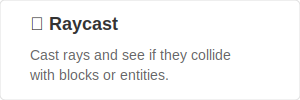

  

  # Bookshelf Library

  Bookshelf is a library datapack for Minecraft. It's modular, so mapmakers can pick only the parts they need. This helps them create complex systems more easily.

 

  
  &nbsp;
  
  &nbsp;
  
  &nbsp;
  

 

# 🌟 Featured modules

  <a href="https://docs.mcbookshelf.dev/en/latest/modules/block/">
    <picture>
      <source media="(prefers-color-scheme: dark)" alt="block" srcset="docs/_imgs/readme/block-dark.svg">
      
    </picture>
  </a>
  &nbsp;
  <a href="https://docs.mcbookshelf.dev/en/latest/modules/raycast/">
    <picture>
      <source media="(prefers-color-scheme: dark)" alt="raycast" srcset="docs/_imgs/readme/raycast-dark.svg">
      
    </picture>
  </a>
  &nbsp;
  <a href="https://docs.mcbookshelf.dev/en/latest/modules/math/">
    <picture>
      <source media="(prefers-color-scheme: dark)" alt="math" srcset="docs/_imgs/readme/math-dark.svg">
      
    </picture>
  </a>
  &nbsp;
  <a href="https://docs.mcbookshelf.dev/en/latest/modules/generation/">
    <picture>
      <source media="(prefers-color-scheme: dark)" alt="generation" srcset="docs/_imgs/readme/generation-dark.svg">
      
    </picture>
  </a>
  &nbsp;
  <a href="https://docs.mcbookshelf.dev/en/latest/modules/random/">
    <picture>
      <source media="(prefers-color-scheme: dark)" alt="random" srcset="docs/_imgs/readme/random-dark.svg">
      
    </picture>
  </a>
  &nbsp;
  <a href="https://docs.mcbookshelf.dev/en/latest/modules/health/">
    <picture>
      <source media="(prefers-color-scheme: dark)" alt="health" srcset="docs/_imgs/readme/health-dark.svg">
      
    </picture>
  </a>

And much more!

# 🔥 Motivation

Libraries save time and make systems easier to create. But many Minecraft mapmakers aren't used to them. Bookshelf exists to change that.
Bookshelf focuses on ease of use. Each module is simple, works for any skill level, and keeps performance in mind.

> "I have seen further than others because I have stood on the shoulders of giants."
>
> -- Isaac Newton

# 🤝 Contribution

Have questions or want to talk about the project? Join the [Discord](https://discord.gg/MkXytNjmBt) server.

Want to help? See the [contribution](https://docs.mcbookshelf.dev/en/latest/contribute/index.html) section.
